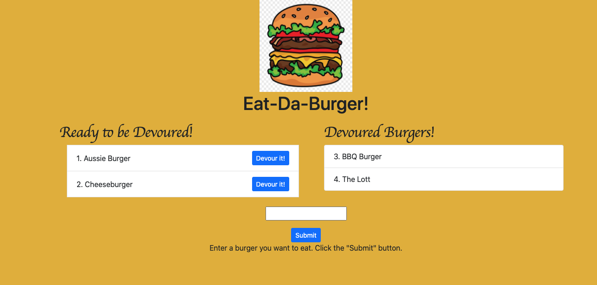

# Burger APP

  ## Description
  An APP that controls a list of burger devoured and desired done with MySQL, Node, Express, Handlebars and a homemade ORM following the MVC design pattern; using Node and MySQL to query and route data in the app, and Handlebars to generate HTML. T
  
  ## Table of contents
  
  * [Installation](#installation)
  * [Usage](#usage)
  * [License](#license)
  * [Contributing](#contributing)
  * [Questions](#questions)
  

  ## Installation
  
  This app is hosted on heroku. You can access the app by clicking [here](https://peaceful-wave-27585.herokuapp.com/).

  ## Usage
  
  The app has a list of pre-defined burgers in its database that are ready to be devoured. If you click on the devour button next to each item in that list, it will be moved to the list of devoured burgers on the right side of the page. You can also create new burgers by typing their names in the provided form on the page and clicking the submit button that will then add them to the list of burgers ready to be devoured on the left side of the page. 

  

  ## License
  This project is licensed under the MIT.

  ## Contributing
  See [Questions](#Questions) section.

  ## Questions
  If you have any questions about the repo, open an issue or contact me directly at gguedesantonio@gmail.com. 
  You can find more about my work at [Github profile](https://github.com/guedesantonio). 
